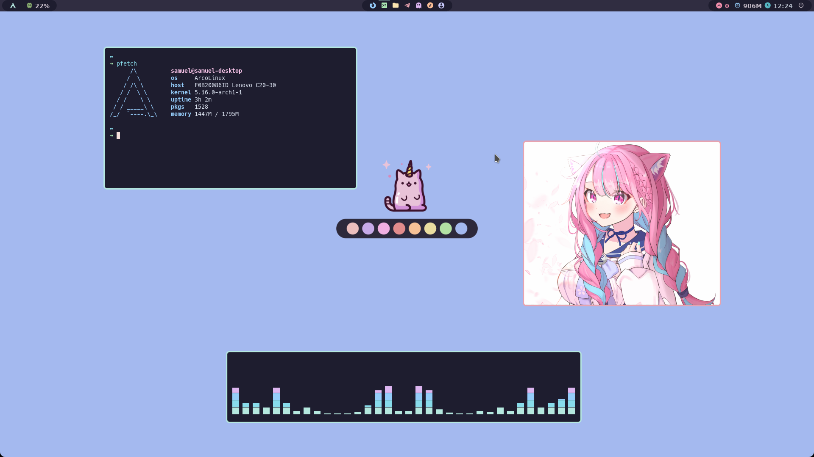

<p align="center">
  
</p>

<p align="center">
  <b> Catppuccin BSPWM </b>
</p>



# What do i use?

- **Window manager :** Of course BSPWM
- **Terminal emulator :** Alacritty
- **Text editor :** NeoVim
- **Bar :** Polybar
- **Music player:** mpd & ncmpcpp
- **Colorscheme i use:** [Catppuccin](https://github.com/catppuccin/catppuccin)
- **Fonts:** JetBrains mono, Source Code Pro, Hack, Material Design Icon, fontawesome 5, etc
- **Notification daemon:** Dunst

# What you should know

- You can just copy all the things inside cloned repo to your ~/.config folder, and you good to go
- You need to install all the fonts above, otherwise some of the icons won't load properly
- I use 6 workspace, you can adjust how many workspace you need in bspwmrc. Don't forget to add your workspace icon inside polybar config
- You also need to edit some config to match your needs
- You need to run ```chmod +x ~/.config/bspwm/bspwmrc && chmod +x ~/.config/bspwm/autostart.sh``` after copying all the things

# Credits

- Distrotube's [Dmenu](https://gitlab.com/dwt1/dmenu-distrotube)
- I steal [Mangeshrex's](https://github.com/mangeshrex) polybar config xDD
- A random guy on r/unixporn discord that help me configure picom


